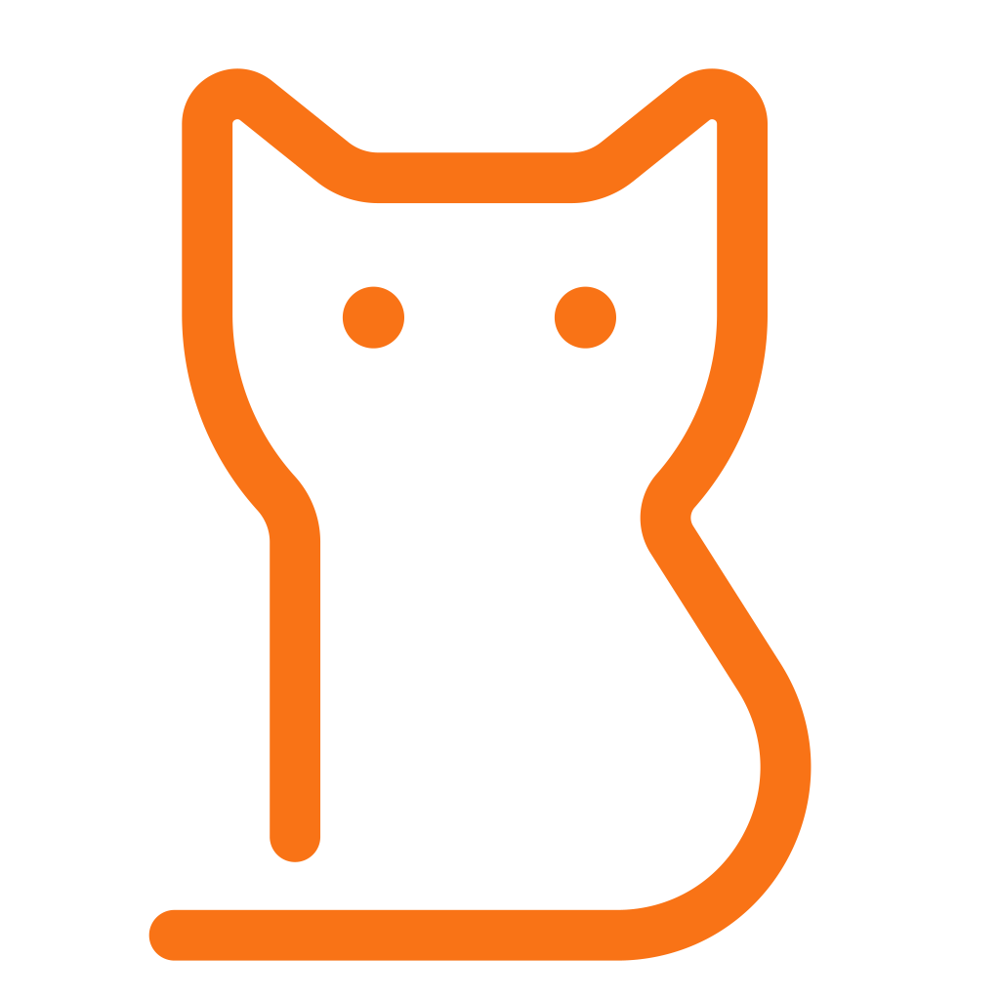

<p align="center">
 
</p>

# LomoCat 的猫窝

<p align="center">
 
 
 
 
 
 
 
</p>

**LomoCat 的猫窝** —— 一只写代码的猫的个人博客。

使用 Next.js 15 (App Router) + React 19 + TypeScript 构建，SQLite (better-sqlite3) 存储数据，Tailwind CSS 4 设计样式，部署在阿里云上（systemd + nginx 托管）。

博客地址：[lomocat.xyz](https://lomocat.xyz)

## 功能特色

- ✍️ **Markdown 写作** — 用 frontmatter + Markdown 写文章，支持代码高亮、表格、GFM 语法
- 🌓 **亮/暗模式** — 主题切换，CSS 变量驱动
- 🌐 **中/英双语** — 内置 i18n 国际化，一键切换
- 🎵 **音乐播放器** — 右下角浮动播放器，支持单曲循环/列表循环/随机播放
- 🐱 **猫爪背景** — 滚动视差猫爪装饰，192 个随机位置
- 💬 **评论区** — 支持嵌套回复、数学验证码、频率限制
- 🍲 **今天吃什么** — 521 道菜，15 个菜系，多维度匹配推荐，抽签动画
- 🔍 **全文搜索** — 搜索文章内容
- 📊 **访问统计** — 趋势图、热门页面、来源分析
- 🖥️ **服务器状态** — CPU/内存/磁盘/网络实时监控
- 📱 **响应式设计** — 桌面端文章目录、移动端友好
- 🔧 **管理后台** — 文章/音乐/美食/友链/站点一站式管理

## 技术栈

| 层 | 技术 |
|---|---|
| **框架** | Next.js 15 (App Router, SSG/ISR) |
| **UI** | React 19 + Tailwind CSS 4 |
| **语言** | TypeScript 5.7 |
| **数据库** | SQLite (better-sqlite3) |
| **内容** | Markdown (gray-matter + react-markdown) |
| **部署** | Alibaba Cloud ECS, systemd, nginx |
| **SSL** | Let's Encrypt |

## 项目结构

```
my-blog/
├── src/
│   ├── app/                    # Next.js App Router 页面
│   │   ├── page.tsx            # 首页（交错文章卡片列表）
│   │   ├── layout.tsx          # 根布局（导航栏 + 页脚 + 猫爪背景）
│   │   ├── posts/[slug]/       # 文章详情页（SSG 构建）
│   │   ├── archive/            # 文章归档（按年/月分组）
│   │   ├── search/             # 全文搜索页
│   │   ├── tags/               # 标签聚合页
│   │   ├── food/               # 「今天吃什么」抽签器
│   │   ├── server/             # 服务器状态监控页
│   │   ├── links/              # 友链展示页
│   │   ├── admin/              # 管理后台（登录 + 内容管理）
│   │   └── api/                # 公开 API 路由
│   ├── components/             # 共享组件
│   │   ├── Header.tsx          # 导航栏（含 i18n 切换 + 主题切换）
│   │   ├── PostCard.tsx        # 文章卡片（3D 倾斜 + 滚动淡入）
│   │   ├── Comments.tsx        # 评论组件（嵌套回复 + 验证码）
│   │   ├── MusicPlayer.tsx     # 音乐播放器（带拖拽功能）
│   │   ├── PawDecorations.tsx  # 猫爪背景装饰（视差滚动）
│   │   ├── TableOfContents.tsx # 文章目录（桌面端左侧）
│   │   └── ThemeProvider.tsx   # 主题上下文
│   ├── lib/                    # 工具库
│   │   ├── db.ts              # SQLite 数据库连接与维护
│   │   ├── posts.ts           # 文章读取与元数据处理
│   │   ├── i18n.ts            # 国际化工具函数
│   │   ├── captcha.ts         # 验证码生成与验证
│   │   └── site-content.ts    # 站点配置（标题、关于、页脚）
│   ├── content/posts/         # Markdown 文章源文件
│   └── locales/               # i18n 翻译文件
│       ├── zh.json
│       └── en.json
├── public/                     # 静态资源
│   ├── music/                  # 音乐文件（MP3）
│   ├── favicon.svg             # 站点图标
│   └── ...
├── data/
│   └── blog.db                # SQLite 数据库文件
├── scripts/
│   └── compress-music.js      # 音乐压缩脚本
├── nginx.conf                 # Nginx 反向代理配置
└── blog.service               # systemd 服务单元文件
```

## 快速开始

### 环境要求
- Node.js 22+
- npm

### 本地开发

```bash
git clone git@github.com:LoMoCatAp/my-blog.git
cd my-blog
npm install
echo "BLOG_ADMIN_PASSWORD=your-password" > .env.local
npm run dev
```

访问 `http://localhost:3000`。

### 构建与启动

```bash
# 生产构建
npm run build

# 启动生产服务器
npm start
```

## 部署

博客通过 systemd + nginx 部署在阿里云 ECS。

- **systemd 服务**：参见 `blog.service`
- **Nginx 配置**：参见 `nginx.conf`
- **SSL 证书**：Let's Encrypt，自动续签

```bash
# 重启博客服务
sudo systemctl restart blog

# 查看日志
journalctl -u blog -f
```

## 管理后台

访问 `https://lomocat.xyz/admin`，使用 `.env.local` 中设置的密码登录。管理后台功能：

- ✏️ **文章管理** — 新建、编辑、删除文章，支持设置封面图
- 🎵 **音乐管理** — 上传 MP3，管理播放列表
- 🍲 **美食管理** — 管理「今天吃什么」数据库
- 🔗 **友链管理** — 管理友情链接
- ⚙️ **站点设置** — 修改首页标题、副标题、关于页
- 📊 **访问统计** — 查看趋势图与热门页面

## 文章写作

在 `src/content/posts/` 下创建 `.md` 文件：

```markdown
---
title: "文章标题"
date: "2026-06-20"
tags: ["标签1", "标签2"]
description: "文章摘要"
published: true
image: "https://..."  # 可选自定义封面图
---

正文 Markdown 内容...
```

也可在管理后台直接在线写作。

## 开发验证

```bash
npm run lint
npm run build
```

## 当前限制

- 文章在新增或编辑后需要手动点击「重新构建」以生成静态页面
- 音乐上传后需运行 `npm run compress-music` 手动压缩
- 无 CI/CD，部署依赖手动构建与重启
- 域名正在备案中（当前可通过 `47.104.224.159` IP 直连）

## 作者

- **洛陌（Lomo）** — [lomocat.xyz](https://lomocat.xyz)
- GitHub: [@LoMoCatAp](https://github.com/LoMoCatAp)

## 许可证

保留所有权利。本项目仅供个人参考和学习，未经允许不得用于商业用途。
